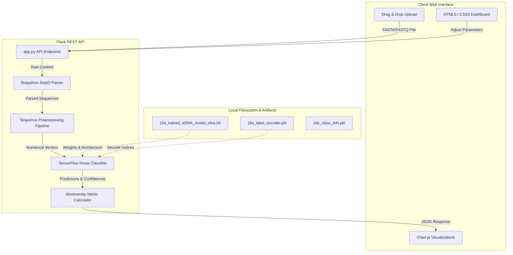

# 404 Specie Not Found - Tech Stack & Architecture Explanation

This document explains the technical architecture, algorithms, and libraries driving the **Deep-Sea eDNA Analysis Platform**. It details how environmental DNA (eDNA) sequences are ingested, preprocessed, classified via deep learning, and visualized as biodiversity indices.

---

## Scientific Context: Why 18S rRNA?

**Environmental DNA (eDNA)** is genetic material shed by organisms into their surrounding environment (such as seawater). In deep-sea ecosystems, collecting specimens is difficult. Sequencing eDNA provides a non-invasive way to survey biodiversity.

The **18S ribosomal RNA (rRNA)** gene is a standard genetic marker for eukaryotic organisms. It contains hypervariable regions (which differ among species) flanked by highly conserved regions (which are similar across all eukaryotes). This makes it ideal for PCR amplification and taxonomic identification of eukaryotic communities, including protists, algae, fungi, and deep-sea metazoa (animals).

---

## System Architecture

The platform uses a decoupled client-server architecture:

---

## The Tech Stack

### 1. Frontend Technologies
* **HTML5 & Vanilla CSS**: Custom layout using a modern grid and flexbox system. Employs a glassmorphism aesthetic tailored to a "deep-sea" environment using a curated palette:
  * `--dark`: `#0a1a2a` (Abyssal black-blue)
  * `--primary`: `#1a3a5f` (Oceanic navy)
  * `--accent`: `#4db4d7` (Bioluminescent light blue)
  * `--light`: `#e8f4f8` (Ice blue)
* **Vanilla JavaScript (ES6+)**: Handles user interactions, manages file upload drag-and-drop mechanics, executes asynchronous queries using the `Fetch API`, and handles UI tab switching.
* **Chart.js (v3+)**: An open-source HTML5 canvas charting library. Used to render:
  * A **Doughnut Chart** displaying community phylum composition.
  * A **Bar Chart** representing species richness across taxonomic ranks.
* **FontAwesome (v6.4.0)**: Delivers vectors/icons for biological structures, folders, and marine elements.

### 2. Backend Technologies (Python 3)
* **Flask (v2.3.3) & Flask-CORS (v4.0.0)**: Serves as the gateway REST API, configuring Cross-Origin Resource Sharing to support running the frontend client from the filesystem or distinct ports.
* **Biopython (v1.81)**: The `Bio.SeqIO` sub-module is utilized to parse sequences out of structural file formats (FASTA/FASTQ) directly from in-memory stream buffers (`io.StringIO`).
* **TensorFlow / Keras (v2.13.0)**: Machine learning platform used to load and query the pre-trained neural network (`.h5` format) to run batch classifications.
* **Scikit-learn (v1.3.0) & Joblib (v1.3.2)**: Used to load the serialized target mappings (`LabelEncoder`) to decode predicted integer outputs back to scientific taxonomic categories.
* **NumPy (v1.24.3) & Pandas (v2.0.3)**: Power numerical matrix manipulation, class frequency counting, and data structures.

---

## How It Works (Step-by-Step Data Flow)

### Step 1: File Parsing
When a user uploads a file, `app.py` reads the binary stream and converts it into a UTF-8 string:
* The extension is checked (`.fasta`, `.fa`, `.fna`, `.fastq`, `.fq`, or `.gz`).
* `SeqIO.parse()` iterates over the stream, extracting the unique biological header (description) and the raw nucleotide sequence of each read.
* To ensure stable performance, the server caps analysis at the first **1000 sequences** for very large datasets.

### Step 2: Preprocessing and Numerical Encoding
Deep learning models cannot ingest raw nucleotide strings (`"ACTG..."`) directly; they require numerical tensor inputs. The pipeline standardizes the sequences:

1. **Ambigous Base Cleaning**: All characters that are not standard nucleotides are mapped to `N` (representing unknown bases):
   $$\text{Sequence} \rightarrow \text{Regex Substitution} \rightarrow [A, C, G, T, N]$$
2. **Fixed-Length Padding and Trimming**: The classifier requires a fixed tensor input of shape `(batch_size, 1500)`.
   * If a sequence is longer than $1500\text{ bp}$, the **middle section** is cropped (since hypervariable regions of eukaryotic 18S are typically located centrally).
   * If a sequence is shorter than $1500\text{ bp}$, it is padded at the end with `'N'` characters up to the $1500$ length.
3. **Vocabulary Mapping**: Characters are translated into integers using a hardcoded vocabulary dictionary:
   $$\text{'N'} \rightarrow 0, \quad \text{'A'} \rightarrow 1, \quad \text{'C'} \rightarrow 2, \quad \text{'G'} \rightarrow 3, \quad \text{'T'} \rightarrow 4$$

### Step 3: Deep Learning Taxonomic Classification
The numeric vector is passed to the Keras model (`18s_trained_eDNA_model_silva.h5`). 
* The model executes a forward pass, outputting a probability distribution array of size $C$, where $C$ is the number of trained taxonomic classes (derived from the SILVA database).
* **Inference**:
  $$\text{Predicted Class Index} = \operatorname{argmax}(\vec{y}_{\text{pred}})$$
  $$\text{Confidence Score} = \max(\vec{y}_{\text{pred}})$$
* **Taxa Decoding**: The index is passed to the loaded `18s_label_encoder.pkl` to fetch the scientific taxonomic label (e.g. genus/species name).
* The top 3 predictions and their probabilities are saved for research review.

### Step 4: Biodiversity Metrics Calculation
After predicting the taxonomies, the platform filters out low-confidence outputs based on the user-defined threshold $T$ (default: `0.70`). It then calculates biodiversity metrics:

#### 1. Shannon-Wiener Diversity Index ($H'$)
This index measures both species richness (how many species are present) and evenness (how evenly distributed the individuals are among those species):
$$H' = -\sum_{i=1}^{S} p_i \ln(p_i)$$
Where:
* $S$ is the total number of identified unique taxonomic classes.
* $p_i$ is the proportion of high-confidence sequence reads belonging to the $i$-th taxon:
  $$p_i = \frac{n_i}{N_{\text{total}}}$$
* A higher $H'$ indicates a more diverse, healthy ecosystem. The code includes a small smoothing constant ($10^{-10}$) inside the calculation to avoid logarithmic exceptions for zero counts.

#### 2. Phylum Categorization
To simplify visualization, the system analyzes the decoded string for keywords and aggregates them into high-level groups:
* **Animals**: If scientific tags include `Animal` or `Metazoa`.
* **Plants**: If tags include `Plant` or `Archaeplastida`.
* **Fungi**: If tags contain `Fungi` or `Yeast`.
* **Protists**: If tags match unicellular algae, ciliates, or amoeboid groups (`Protist`, `Algae`, `Diatom`).
* **Rare Eukaryotes / Others**: Catches unassigned or highly rare lineages (`Other_Rare_Eukaryotes`).

#### 3. Novel Taxa Index
Sequences that run through the model but produce a classification probability below the threshold ($Confidence < T$) represent genetic code that the model cannot confidently assign to any known reference class.
* These are tagged as **Novel Sequence Candidates**.
* The **Novelty Score** is computed as:
  $$\text{Novelty Score} = 1 - \text{Average Confidence}$$
  This serves as an indicator of potential discovery rates in unexplored zones.

### Step 5: Frontend Visualization Rendering
The backend packages this statistics structure into a JSON response. The client JavaScript extracts:
1. **Overview Metrics**: Updates DOM text nodes (`Total Sequences`, `Average Length`, `Quality Score`, `Shannon Index`, `Novel Taxa`).
2. **Dominant Taxa List**: Dynamically builds HTML table rows listing target tax
onomic classes and their counts.
3. **Phylum Composition (Doughnut Chart)**: Populates a Chart.js doughnut instance with the grouped phylum counts.
4. **Richness by Taxonomic Level (Bar Chart)**: Plots the estimated number of unique groups detected across the biological hierarchy levels: Phylum, Class, Order, Family, Genus, and Species.
